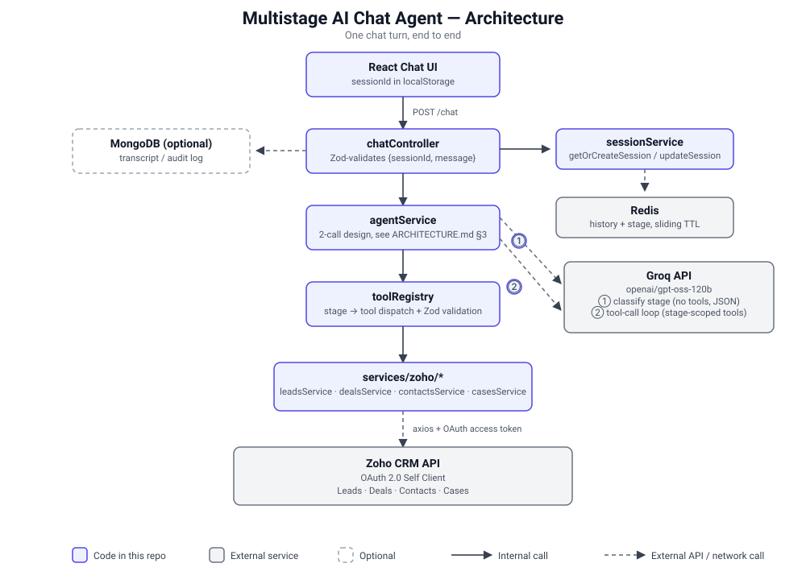

# Multistage AI Chat Agent — Automotive OEM / Zoho CRM

A chat agent that handles four customer lifecycle stages for an automotive
OEM — New Lead, Ongoing Pipeline, Booked Vehicle, and Post-Purchase/Service
— reading and writing Zoho CRM in real time via Groq's native tool calling.



See `ARCHITECTURE.md` for the full system design and design decisions,
`docs/ZOHO_FIELDS.md` for the exact CRM field mapping, and `PROGRESS.md`
for the build history (including every real bug found during live testing
and how it was fixed — worth a skim if something in this README doesn't
quite match what you see, since a few defaults changed after hitting real
Zoho/Groq behavior that isn't obvious from their docs alone).

## Stack

- **Frontend:** React + TypeScript (Vite)
- **Backend:** Node.js + Express + TypeScript (routes → controllers → services)
- **LLM:** Groq API, direct SDK calls, native tool/function calling (no LangChain)
- **Session state:** Redis (conversation history + current lifecycle stage), sliding TTL
- **CRM:** Zoho CRM via OAuth 2.0 Self Client, plain axios calls (no SDK)

## Prerequisites

- Node.js 20+ and npm
- A Zoho CRM account (a free trial works)
- A Redis instance — local (`redis-server`) or hosted (e.g. [Upstash](https://upstash.com), free tier)
- A Groq API key — free at [console.groq.com](https://console.groq.com), no card required

## 1. Install

```bash
git clone https://github.com/sumedh500/sumedh500.git
cd sumedh500
cd backend && npm install
cd ../frontend && npm install
```

## 2. Set up Zoho CRM

### 2a. Create custom fields

Zoho's default modules don't have the fields this project reads/writes.
Follow **`docs/ZOHO_FIELDS.md`** to add them (Setup → Customization →
Modules and Fields):

- **Leads:** `Vehicle_Model`
- **Deals:** `Follow_Up_Preference`, `VIN`, `Allocation_Stage`, `Payment_Link`, `Booking_Id`
- **Cases:** `Registration_Number`, `Odometer_Reading`, `Issue_Type`, `Preferred_Service_Center`

You do **not** need to add a custom Sales Stage — the Booked Vehicle flow
matches on the standard `Closed Won` stage (see `ARCHITECTURE.md` §12 for
why; a custom stage value gets silently dropped by a fresh Zoho org unless
you configure it first, which is more setup than it's worth here).

### 2b. Create a Self Client and get OAuth credentials

1. Go to the [Zoho API Console](https://api-console.zoho.com) (use the
   subdomain matching your account's data center, e.g.
   `api-console.zoho.in` — check the URL you're redirected to after login)
2. **Add Client → Self Client** — this gives you a **Client ID** and
   **Client Secret**
3. Copy both into `backend/.env` (see step 3) as `ZOHO_CLIENT_ID` /
   `ZOHO_CLIENT_SECRET`, and set `ZOHO_DC` to match your API console's
   domain suffix (`com`, `in`, `eu`, etc.)
4. In the Self Client, open **Generate Code**, enter scopes:
   ```
   ZohoCRM.modules.leads.ALL,ZohoCRM.modules.deals.ALL,ZohoCRM.modules.cases.ALL,ZohoCRM.modules.contacts.ALL
   ```
   pick a short validity window, and generate — this gives you a
   **grant token** valid for a few minutes only
5. Immediately exchange it for a refresh token:
   ```bash
   cd backend
   npm run zoho:refresh-token <grantToken>
   ```
   It prints a `ZOHO_REFRESH_TOKEN=...` line — **copy that exact value**
   into `backend/.env`. (Common mistake: pasting the grant token itself
   into `.env` instead of the refresh token this command prints — they're
   different strings, and using the wrong one gives an `invalid_code`
   error at runtime.)

## 3. Configure environment variables

```bash
cp .env.example backend/.env
cp frontend/.env.example frontend/.env   # only needed if not using localhost:4000
```

Fill in `backend/.env`:
- `GROQ_API_KEY` — from console.groq.com
- `ZOHO_CLIENT_ID`, `ZOHO_CLIENT_SECRET`, `ZOHO_DC`, `ZOHO_REFRESH_TOKEN` — from step 2
- `REDIS_URL` — see below

### Redis URL — local vs. hosted

**Local:** `redis://localhost:6379` (just run `redis-server`).

**Hosted (e.g. Upstash):** use the **native Redis connection string**, not
the REST API URL — they're two different things Upstash shows you, and
only the native one works with this backend (`ioredis` speaks the Redis
wire protocol, not HTTP). It must start with `rediss://` (double "s") for
TLS:
```
REDIS_URL=rediss://default:<password>@<host>:<port>
```
If you copy Upstash's `redis-cli --tls -u redis://...` snippet, note it
uses a separate `--tls` flag — for our single `REDIS_URL` string, that
same TLS-ness has to be encoded as `rediss://` instead of `redis://`, or
the connection will fail with `MaxRetriesPerRequestError` and no other
detail. If that happens, the backend prints `Connecting to Redis at
<host>:<port> (tls: true/false)` at startup — check that `tls` says
`true`.

## 4. Seed Zoho with mock data

```bash
cd backend
npm run seed:zoho
```

Creates 1 Lead, 1 in-progress Deal (Ongoing Pipeline), and 1 Deal at the
booking stage, plus their linked Contacts. Prints the phone numbers/IDs to
use for manual testing.

## 5. Run

```bash
# terminal 1
cd backend && npm run dev

# terminal 2
cd frontend && npm run dev
```

Open the URL Vite prints (typically `http://localhost:5173`).

## 6. Try it

Use the phone numbers/IDs `seed:zoho` printed. One phone number per
customer maps to a different stage:

| Stage | Try saying | Uses |
|---|---|---|
| New Lead | "Hi, I'm interested in the XUV700" | (any new name/phone/email/city) |
| Ongoing Pipeline | "What's the status of my quotation, phone `<pipeline phone>`?" | Rohan Mehta's seeded phone |
| Booked Vehicle | "What's the delivery status for phone `<booking phone>`?" | Priya Iyer's seeded phone |
| Post-Purchase | "I need to book a service, my number is `<either phone>`" | any seeded contact's phone |

Watch the backend terminal alongside the chat — it logs the stage
classifier's decision on every turn, and every Zoho Contact/Deal lookup,
so you can see the routing and CRM calls happening, not just the final
reply.

Start a **fresh browser session** (private window, or clear the
`chat-session-id` key from `localStorage`) between different-stage tests —
the conversation history is sticky by design (that's what keeps the agent
from re-asking who you are every turn), which means testing a second
stage in the same tab can carry over context from the first.

## Alternative: CLI test harness

Skips the frontend entirely — useful for quickly iterating on the agent
core without a browser:

```bash
cd backend
npm run test:agent
```

## Troubleshooting

- **`invalid_client` from the Zoho token exchange** — almost always a
  `ZOHO_DC` mismatch. Check the URL of the API Console page you used
  (`api-console.zoho.<DC>`) and make sure `ZOHO_DC` matches exactly.
- **`invalid_code`** — `ZOHO_REFRESH_TOKEN` in `.env` is probably holding
  the grant token (the short-lived code you passed as a CLI argument)
  instead of the refresh token the exchange script printed afterward.
- **`Missing Zoho OAuth env var(s): ...`** — names exactly which of
  `ZOHO_CLIENT_ID` / `ZOHO_CLIENT_SECRET` / `ZOHO_REFRESH_TOKEN` is
  missing from `backend/.env`.
- **Redis `MaxRetriesPerRequestError`** — see the Redis section above;
  check the `Connecting to Redis at ...` startup log for the parsed
  host/port/TLS.
- **A CRM lookup by phone returns "not found" for a phone number you know
  is seeded** — phone numbers are normalized to `+91XXXXXXXXXX` before
  searching (`backend/src/utils/phone.ts`), so most formats work, but this
  is India-specific; a non-Indian number won't normalize correctly.
- **Groq model errors (`model_not_found` or similar)** — Groq
  deprecates/renames models periodically; check `GROQ_MODEL` in `.env`
  against [Groq's current model list](https://console.groq.com/docs/models)
  if the default in `.env.example` has gone stale since this was written.

## Project structure

```
backend/    Express + TypeScript API (routes → controllers → services)
frontend/   Vite + React + TypeScript chat UI
docs/       Zoho field mapping, architecture diagram, demo video checklist
```

See `ARCHITECTURE.md` for the full folder tree and design rationale.

## Recording a demo

`docs/DEMO_VIDEO_CHECKLIST.md` has a timed script for a 5–7 minute demo
covering all 4 stages plus showing each CRM write land in Zoho in real
time.

## Deploying

`DEPLOYMENT.md` has step-by-step instructions for deploying the backend
to Render and the frontend to Vercel (both free tier).
